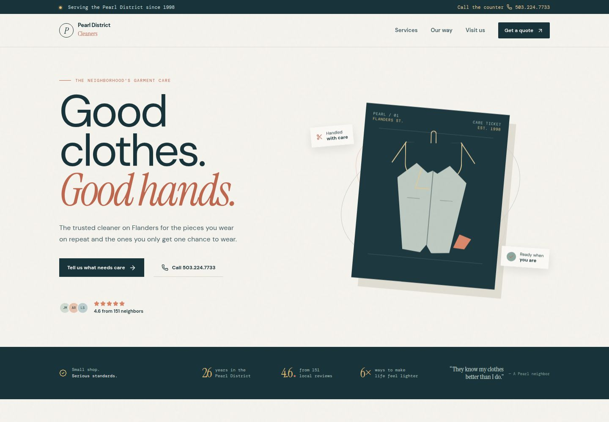

# Pearl District Cleaners



A polished, pitch-ready website concept for Pearl District Cleaners, a neighborhood dry cleaner serving Portland's Pearl District.

## About

The site presents Pearl District Cleaners as a trusted local service with a warm, editorial identity and clear paths to get in touch.

- Dry cleaning, wash and fold, and garment care
- Wedding attire, duvet, curtain, and stain treatment services
- 4.6 rating from 151 neighborhood reviews
- Contact, directions, hours, and quote-request interactions
- Responsive layout for desktop and mobile

## Run locally

This project uses pnpm workspaces.

```bash
pnpm install
pnpm --filter @workspace/pearl-district-cleaners run dev
```

The site is served through the workspace's configured preview workflow.

## Business details

- **Address:** 1427B NW Flanders St, Portland, OR 97209
- **Phone:** [503-224-7733](tel:+15032247733)
- **Hours:** Open until 6:30 PM

## Project structure

- `artifacts/pearl-district-cleaners` — the website artifact
- `screenshots/pearl-district-cleaners-home.jpg` — README preview image
- `artifacts/api-server` — shared API server scaffold
- `lib` — shared workspace libraries